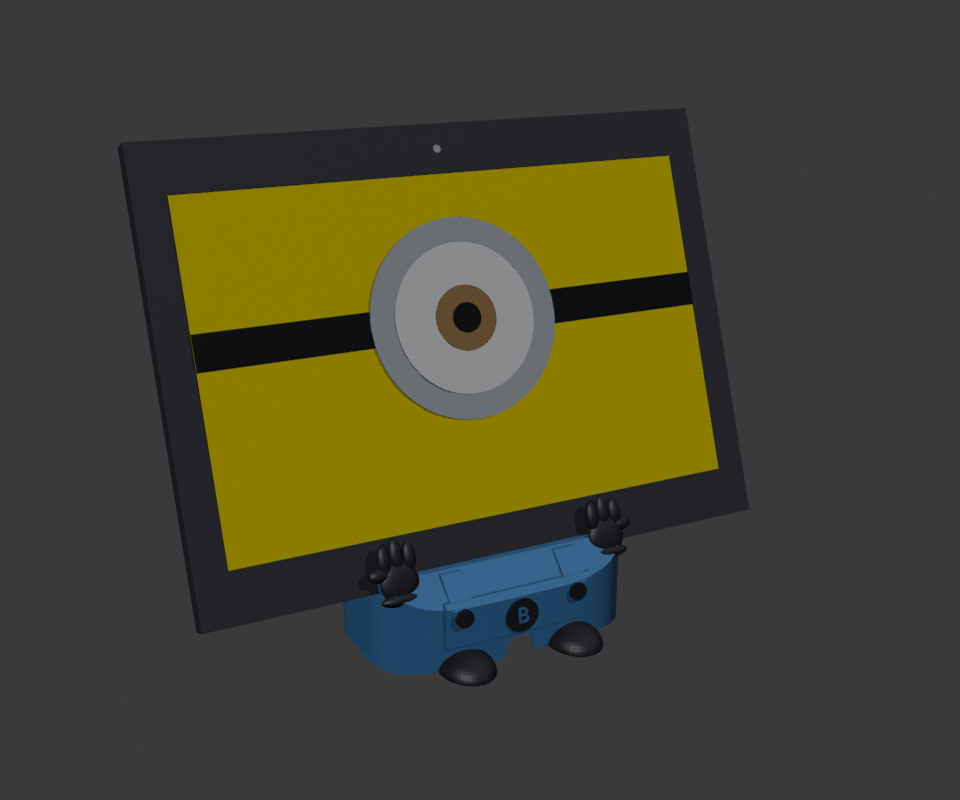

# A printed desk stand for Bello: the Minion's body

| | |
|---|---|
| Status | Designed and checked in software (2026-09-22); not printed yet. Print the fit test first (§5) |
| Branch | `feature/tablet-stand` |
| Files | `hardware/stand/make_stand.py` (Blender, every dimension is a named constant), `bello-stand.stl`, `bello-stand-fit-test.stl`, three preview renders; `scripts/stand.sh build\|slice\|all` |
| Printer | Creality Ender-3, PLA, 0.4 mm nozzle, Cura 5.9 "Standard Quality" (the profile on the Mac) |
| Result | **5 h 36 min, ~35 g of PLA**, no supports (fit test: 45 min, ~4 g). Sliced by Cura's own engine with the Mac's Ender-3 profile |

The screen already shows a Minion face, so the tablet is the head and the stand is the rest of the
Minion: a rounded body in overalls, with a bib, two straps with buttons and a round badge with a
**B** for Bello. Two gloved hands hold the bottom corners of the tablet, and two shoes stick out at
the front. The badge is a B and not Gru's G on purpose: it is a nod to the films, not a copy of
their logo.

## 1. The tablet, measured from published sources

| | Value | Source |
|---|---|---|
| Size (landscape) | **243.4 × 176.4 × 8.0 mm**, 485 g (Wi-Fi model) | [Wikipedia: Samsung Galaxy Tab 4 10.1](https://en.wikipedia.org/wiki/Samsung_Galaxy_Tab_4_10.1); retailers give 7.95–8.0 mm, and the model uses 8.0 plus 0.75 mm of clearance on each side |
| Screen | 10.1" 1280 × 800, 16:10 → active area ≈ 217 × 136 mm, so the bezels are ≈ 13 mm left and right and **≈ 20 mm top and bottom** | same page; the size reported by `adb shell wm size` is 1280x800 |
| Layout | from Samsung's *SM-T530 user manual*, "Device layout", p. 7 ([PDF](https://images10.newegg.com/User-Manual/User_Manual_34-131-760.pdf), [ManualsLib](https://www.manualslib.com/manual/985075/Samsung-Sm-T530.html?page=7)) | see below |

Held landscape and seen from the front:

- **Top bezel, centre:** the front camera, which Bello uses to notice people (`presence/Presence`).
- **Bottom bezel, centre:** the physical Home button, with the Recent (left) and Back (right)
  touch keys about 31–35 mm either side of it (scaled from the manual's drawing).
- **Top edge, left part:** power, volume, then the microSD slot; the headset jack is at the top-left
  corner.
- **Both short edges:** the **speakers**, in the upper half.
- **Bottom edge, near the centre:** the **micro-USB port** and the microphone.
- **Back:** the rear camera in the upper area, and the GPS antenna window in a top corner.

Nobody publishes the exact distances of the port or the buttons from the corners: no drawing, no
case CAD. The stand therefore leaves generous openings where the exact position doesn't matter.
The one position it depends on, the USB port, has a parameter you can check with a ruler (§5).

## 2. What the stand holds and what it leaves free

| Part | Where | Why it is safe |
|---|---|---|
| Pocket | the bottom edge sits in a 9.5 mm channel, leaning back 20° | 0.75 mm clearance each side |
| Front lip | 5 mm up the bottom bezel | the Home button starts about 7 mm up the 20 mm bezel |
| Gloves | at ±46 mm from the centre, up to ~20 mm up the bezel | their inner edge is 38 mm from the centre, outside the Recent/Back keys (checked by the script). PLA does not trigger touch keys anyway |
| Back rest | 64 mm wide, 40 mm up the back | the rear camera and the antenna are higher; the speakers are on the sides |
| Body | 110 mm wide; the tablet is 243 mm | both speaker edges, the top edge (power, volume, microSD, jack) and the front camera are in the open air |
| Plug slot | 30 mm wide through the pocket floor, straight down into the hollow body | a straight micro-USB plug goes in with the tablet; the microphone next to the port stays open |
| Cable | runs inside the hollow body and out through a notch at the back, then flat on the desk | the tablet's bottom edge is 32 mm above the desk, room for the plug and a gentle bend |
| Tail fin | a thin fin reaching 80 mm back, next to the cable | the tablet leans back, so that side needs reach: the stand tips over only if the middle of the screen is pushed harder than about 1.5 N (~150 g) |

Bello's face is always on, so the heat from the back of the tablet matters. The stand touches the
back only on a 64 × 40 mm rest; the rest of the back is open.

## 3. How the model is made

`hardware/stand/make_stand.py` runs in Blender without a window (`scripts/stand.sh build`) and
builds everything from numbers at the top of the file:

- The body is the intersection of a side profile (vertical front, 45° shoulder up to the lip,
  flat top, 45° slope down at the back) and a rounded "squircle" plan, so it is a capsule and not a box.
- It is **hollow and open underneath**, with 1.2 mm walls. Every inside and outside face is
  vertical, leans back like the tablet, or slopes at 45°, so nothing needs support. The one flat
  ceiling, under the pocket, is a hidden 12 mm bridge.
- Overalls, straps, buttons, badge, gloves and shoes are added, then the tablet pocket, the plug
  slot, the cable notch and the gap between the legs are cut out.

Each build checks that:

- the mesh is watertight and fits the Ender-3 bed;
- a tablet 0.05 mm smaller than the real one doesn't touch the stand anywhere;
- probe points are right: pocket floor, lip and back rest are plastic; the slot, the cable space,
  the notch and the pocket are open;
- the speakers and the touch keys stay free;
- the tablet's centre of mass sits inside the footprint, with the margins printed.

It writes the two STLs and three previews: with the tablet, the stand alone from the front, and
from the back.

The first version was a larger body with a window in a tall back rest and a flat foot plate behind.
It came to 9 h 48 min. Slicing variants with one part removed at a time showed where the time went:

| Part | Cost |
|---|---|
| hollow body | about 4 h |
| back rest | 52 min |
| two heels | 28 min |
| shoes | 23 min |
| overalls details | 21 min |
| gloves | 17 min |

Walls printed at 25 mm/s were most of it. So the plain parts shrank: narrower body, thinner walls,
one fin, a lower rest without a window, smaller shoes. The Minion details all stayed.

## 4. Printing

`scripts/stand.sh slice` runs the CuraEngine bundled with the Cura app on the Mac. It uses the
Ender-3 definition and the **Standard Quality / 0.4 mm / PLA** profile, with the brim and
temperatures of your "ManuCustom1" profile. `hardware/stand/cura_settings.py` evaluates Cura's
setting formulas first: the bare engine doesn't, and would otherwise slice with wrong speeds. The
estimate is the one the Cura app shows for the same profile.

| | |
|---|---|
| File | `hardware/stand/bello-stand.stl`, upright as it comes (flat bottom on the bed) |
| Profile | Standard Quality 0.2 mm, 2 walls, 20 % infill, brim |
| Supports | **off** (your ManuCustom1 profile turns them on: switch them off for this model) |
| Time | **5 h 36 min** for 28 cm³ (~35 g) |
| Size | 116 × 109 × 67 mm |

Optional colours: pause at **z = 31.0 mm (layer 155)** with Cura's *Extensions → Post Processing →
Filament Change* and switch from blue to black. From there up the gloves come out black, and so do
the top 6 mm of the shoulders and the back rest, which the tablet hides. Colour the shoes and
buttons with a black marker, or print everything in one colour.

## 5. Before the full print: the fit test

`bello-stand-fit-test.stl` is the middle 40 mm of the pocket, with the plug slot, cut flat
underneath (45 min, 4 g). Print it and check:

1. The tablet's bottom edge goes into the channel without forcing and doesn't wobble much. If it
   is too tight or too loose, change `CLR`.
2. With the cable plugged into the tablet, the plug goes down through the slot. If the port sits
   too far to one side, measure from the centre of the bottom edge to the centre of the port, put
   it in `USB_OFFSET_MM` (+ to the right, seen from the front), and run `scripts/stand.sh all`
   again.

Then print `bello-stand.stl`. Put the cable through the notch at the back, plug it into the tablet,
and lower the tablet into the pocket with the plug going down the slot. A few stick-on rubber feet
under the rim stop it sliding when you tap the screen.

## 6. Changing it

Everything is a constant at the top of `make_stand.py`: tilt, height above the desk, lip height,
clearance, body width, wall thickness, back rest, fin, gloves, shoes. After a change,
`scripts/stand.sh all` rebuilds the model, runs every check and prints the new print time. A change
that makes the stand hit the tablet, cover a key, or tip too easily stops the build with a message.
Blender 5.2 and Cura 5.9 are the versions it was made with; `BLENDER` and `CURA` point the script
elsewhere.
